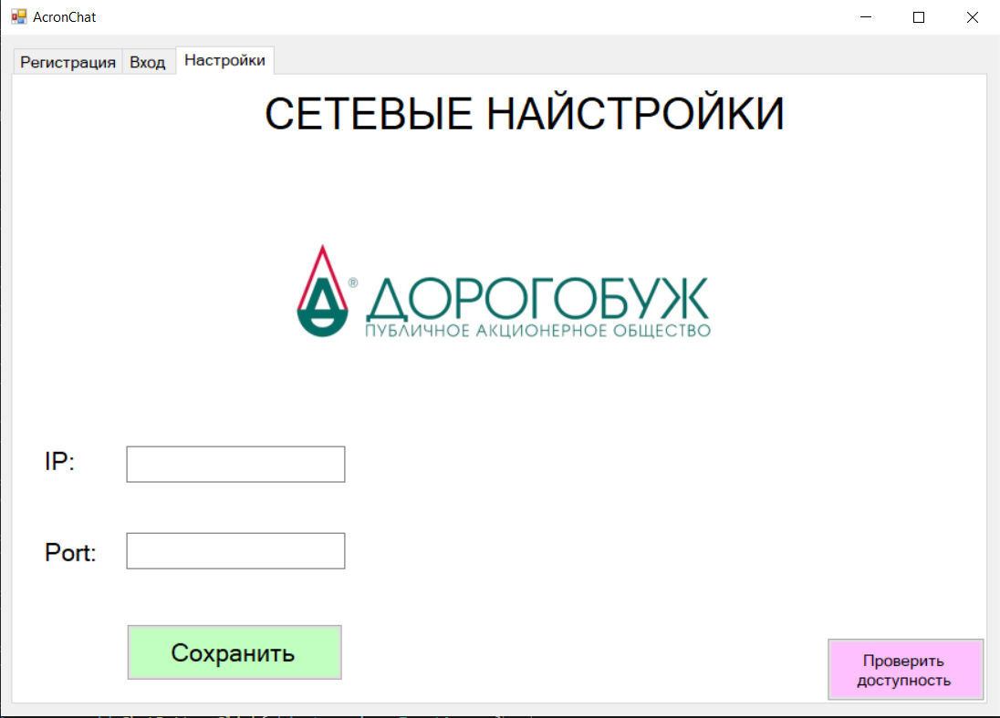
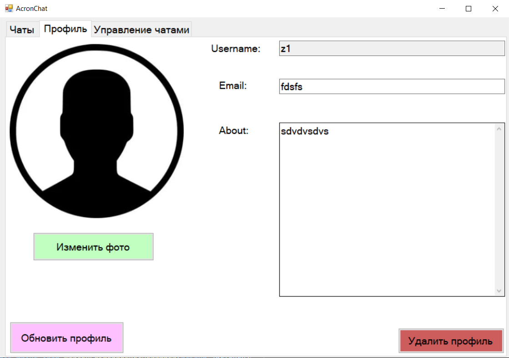
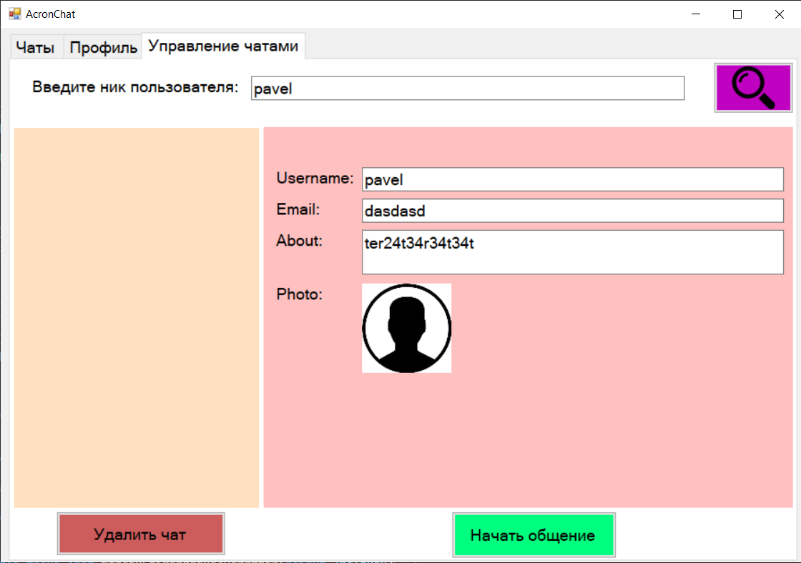

# Корпоративный Мессенджер

## Описание

Корпоративный мессенджер - это приложение для обмена сообщениями в реальном времени, разработанное для использования в корпоративной среде. Клиентская часть написана на C# с использованием WinForms. Приложение позволяет пользователям отправлять и получать сообщения,а также управлять контактами.

## Возможности

- Регистрация и аутентификация пользователей
- Отправка и получение текстовых сообщений
- Управление списком контактов
- Синхронизация сообщений в реальном времени через WebSocket

## Установка

### Требования

- .NET Framework 4.8 или выше
- Visual Studio 2019 или выше

### Шаги установки

1. Клонируйте репозиторий:

    ```bash
    git clone https://github.com/oksanochka88/messengerClient
    ```

2. Откройте решение в Visual Studio.

3. Постройте проект, выбрав `Build` -> `Build Solution`.

4. Запустите приложение, выбрав `Debug` -> `Start Debugging` или нажав `F5`.

## Дизаин приожения:

<details>
  <summary>Нажмите, чтобы увидеть фото</summary>
  
  
  
  
  
  
  

</details>
